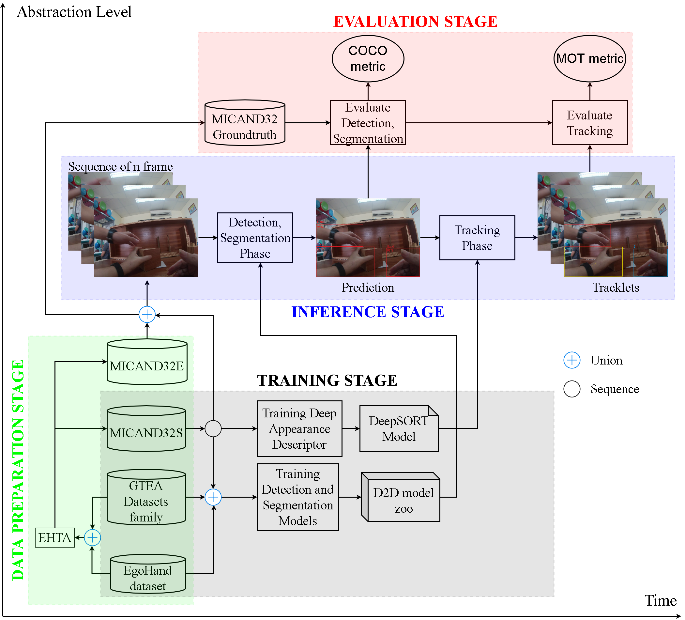
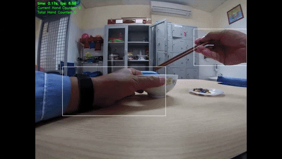

# Detectron2DeepSortPlus
> [**Detectron2DeepSortPlus**](https://drive.google.com/drive/folders/1dNum1GOpYlmHObAR3JvAZqZjTQt1LxRT?usp=sharing),            
> Van-Tien Pham;        


   

> More details can be found [here](https://drive.google.com/drive/folders/1dNum1GOpYlmHObAR3JvAZqZjTQt1LxRT?usp=sharing) and [here](https://youtube.com/playlist?list=PLWBYzJD_wkfs1yHwuUp2Gq9HGCfF5lWiF).\
> Contact: [pvtien96@gmail.com](mailto:pvtien96@gmail.com). Discussions are welcome!

## Abstract


## News
- **[2021.04.15]** [MICARehab](https://drive.google.com/file/d/1ICEgkyGkPQRTa7eY1gMkbMxx-XFVQTk3/view?usp=sharing) dataset released as a benchmark for hand detection and tracking from FPV.
- **[2021.04.10]** Paper is accepted to [RIVF 2021](http://rivf.net/#/).
- **[2020.10.31]** Related [master thesis](https://drive.google.com/file/d/1baZPGa51-un6Gs2KTctRDWQFp_VY2gdN/view?usp=sharing) is successfully defended at [SOICT, HUST](https://soict.hust.edu.vn/).
- **[2020.06.04]** Demo code and pre-trained model released.


## Main results


## Installation

Please refer to [INSTALL.md](readme/INSTALL.md) for installation instructions.

## Model zoo

Trained models are available in the [MODEL_ZOO.md](readme/MODEL_ZOO.md).

## Dataset zoo

Please see [DATASET_ZOO.md](readme/DATASET_ZOO.md) for detailed description of the training/evaluation datasets.

## Getting Started

Follow the aforementioned instructions to install D2DP and download models and datasets.

[GETTING_STARTED.md](readme/GETTING_STARTED.md) provides a brief intro of the usage of builtin command-line tools in D2DP.

## License

Code is released under the [Apache 2.0 license](LICENSE).

## Citing

If you use this work in your research or wish to refer to the results, please use the following BibTeX entry.

```BibTeX
@misc{tien2021d2dp,
  author =       {Van-Tien Pham and Thanh-Hai Tran and Hai Vu},
  title =        {Detection and tracking hand from FPV: benchmarks and challenges on rehabilitation exercises dataset},
  howpublished = {\url{https://github.com/pvtien96/Detectron2DeepSortPlus}},
  year =         {2021}
}
```
